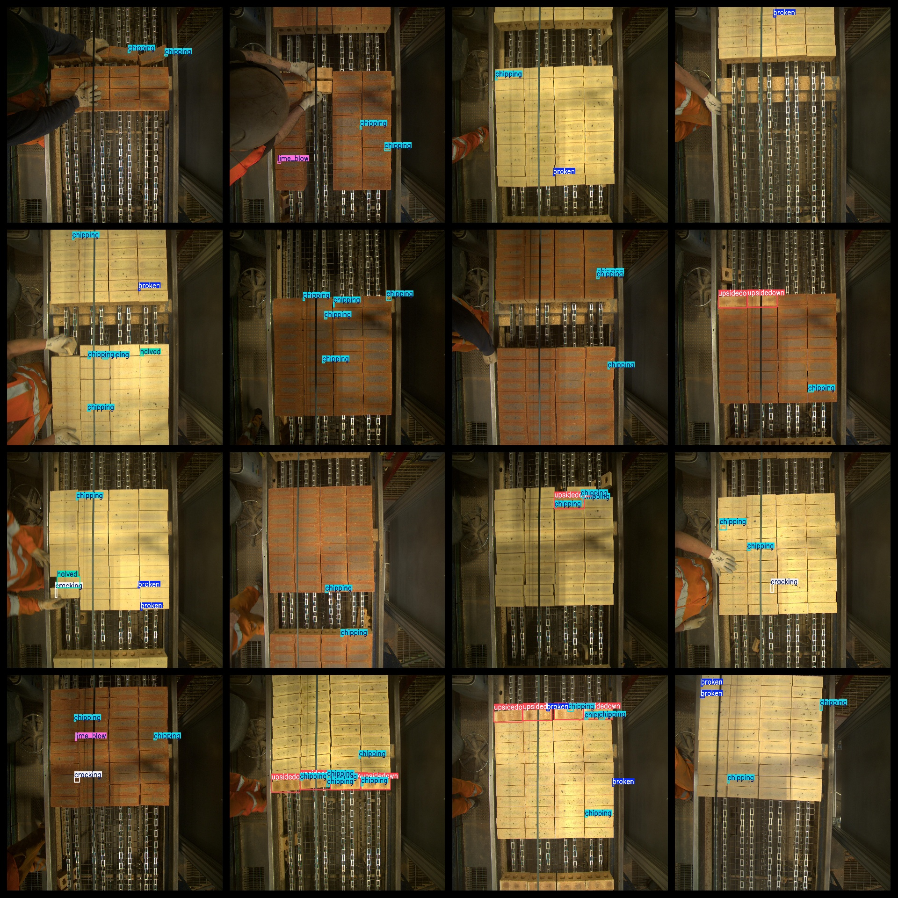
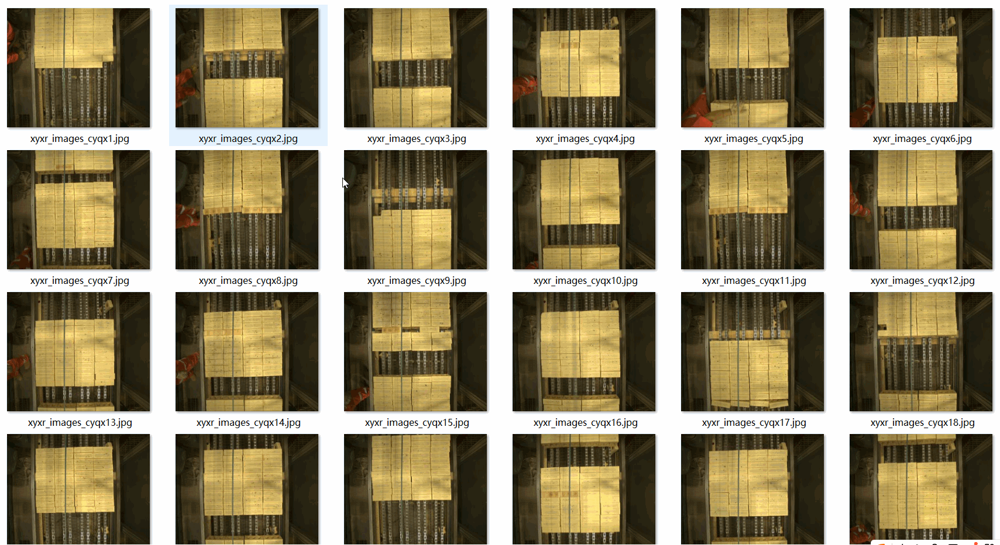

# [Object Detection] Conveyor Belt on Bricks Defect Dataset 1699 images YOLO+VOC format

[Object Detection] Conveyor Belt on Bricks Defect Dataset is a dataset with 1699 images in YOLO+VOC format, including JPEGImages, Annotations, and labels folders. The dataset contains 1699 images, 1699 XML files, and 1699 txt files. The labels folder has a total of 1699 txt files. There are 7 types of labels: broken, chipping, cracking, half-sized, half-sized cracking, lime blow, and upsidedown. The number of boxes for each label is as follows: broken = 1149, chipping = 4341, cracking = 380, half-sized = 177, half-sized cracking = 21, lime blow = 488, and upsidedown = 1407. The total number of boxes is 7963. All the images are in high resolution. The images are not enhanced. The shape of the labels is rectangular boxes, which are used for target detection identification. This dataset does not guarantee the accuracy or precision of the trained models or weight files, only provides accurate and reasonable annotations.

## Images

---

Here is a pay link on Stripe (https://buy.stripe.com/3cs8yP7sY87d0vu9AB). Please contact me lonlonago@foxmail.com after funding $89, and I will send you a complete data files, thank you!

